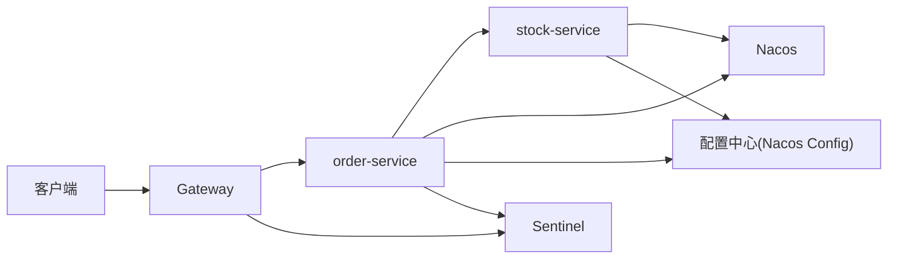
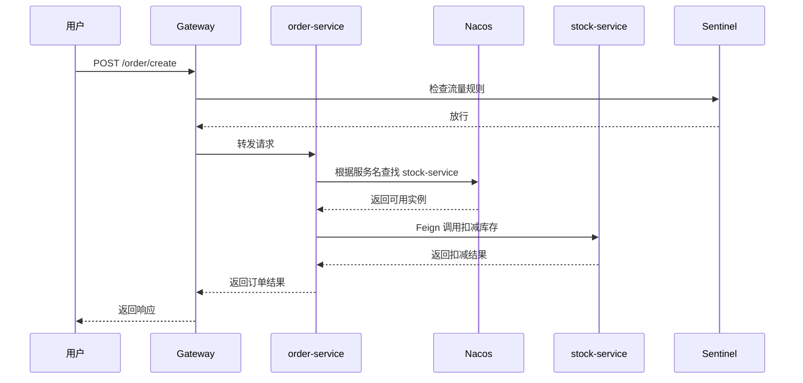

# Spring Cloud Alibaba 入门：Nacos、Feign、Gateway、Sentinel、Seata 到底怎么配合工作

<a class="presentation-link" href="../../presentations/spring-cloud-alibaba-overview-ppt" target="_blank" rel="noopener">
  <span class="presentation-link__icon" aria-hidden="true">
    <span class="presentation-link__glyph">PPT</span>
  </span>
  <span>
    <strong>打开文章演示版</strong>
    <small>浏览器幻灯片版速览，支持方向键和空格切换</small>
  </span>
</a>

很多 Java 开发者第一次学微服务，都会有一种“组件名都认识，但系统还是看不懂”的感觉。

你可能已经听过这些名字：

- `Nacos`
- `OpenFeign`
- `Gateway`
- `Sentinel`
- `Seata`

但第一次接触时，最常见的问题不是“没见过”，而是：

- 为什么微服务一上来就这么多组件
- 它们分别解决什么问题
- 一个真实项目里这些组件到底怎么串起来
- 配置看了不少，为什么还是觉得抽象

这篇文章就是专门为初学者写的。目标不是把所有配置项讲完，而是先帮你建立一张清晰地图，再配一个最小示例，让你知道 Spring Cloud Alibaba 在项目里到底是怎么工作的。

看完这篇，你至少应该能搞清楚：

- 为什么很多 Java 项目会走到 Spring Cloud Alibaba
- `Nacos`、`Feign`、`Gateway`、`Sentinel`、`Seata` 各自干什么
- 一个最小订单系统的调用链是什么样
- 初学者最适合先学什么，后学什么

## 如果你只想记住一条学习路线

对初学者来说，我最推荐的顺序是：

1. 先学 `Nacos`
2. 再学 `OpenFeign`
3. 再学 `Gateway`
4. 再学 `Sentinel`
5. 最后再看 `Seata`

这个顺序和系统复杂度的自然增长顺序几乎一致。你不会一上来就掉进分布式事务这种最重的话题，而是先把微服务的骨架搭起来。

## 为什么很多 Java 项目会走到 Spring Cloud Alibaba

当单体应用规模较小时，很多问题都可以在一个应用内部解决：

- 配置写在同一个项目里
- 接口调用靠本地方法
- 流量入口统一
- 事务也都在单库单服务里完成

但当系统逐步演化后，会出现越来越明显的分工压力：

- 服务职责开始变多
- 团队协作边界变模糊
- 发布影响面越来越大
- 不同模块的扩缩容诉求不同
- 某些基础能力需要统一管理

这时，微服务架构就开始变得有吸引力。它希望通过服务拆分，把原来一个大系统内部的问题，变成多个职责更清晰、边界更明确的服务协作问题。

而 Spring Cloud Alibaba 的价值就在于：它给这些服务协作问题提供了一套比较完整、并且在国内 Java 项目里非常常见的基础设施组合。

## 先把地图看清：这些组件分别解决什么问题

很多初学者学乱的原因，不是组件太难，而是没先分清它们各自负责哪一层。

| 组件 | 主要解决什么问题 | 你可以把它理解成什么 |
|---|---|---|
| `Nacos` | 服务注册发现、配置中心 | 通讯录 + 配置中心 |
| `OpenFeign` | 服务间远程调用 | 声明式 HTTP 调用器 |
| `Gateway` | 系统统一入口 | 微服务大门 |
| `Sentinel` | 限流、熔断、降级 | 流量保护器 |
| `Seata` | 分布式事务协调 | 跨服务事务协调器 |

如果你先记住这张表，后面看配置和代码时就不会觉得“全是零散组件”。

## 一个最小系统：订单服务到底是怎么跑起来的

我们先不讲太多抽象概念，直接看一个最常见的例子。

假设你有一个很小的电商系统，拆成三个服务：

- `gateway-service`
- `order-service`
- `stock-service`

用户下单时，调用链可以理解成这样：



这张图里最关键的是：

- 客户端先访问 `Gateway`
- `Gateway` 把请求转给 `order-service`
- `order-service` 想调库存时，通过服务名去 `Nacos` 里找 `stock-service`
- 服务的配置也可以由 `Nacos Config` 统一管理
- 高并发或异常场景下，`Sentinel` 可以保护系统

这就是为什么说 Spring Cloud Alibaba 不是一堆独立工具的堆砌，而是一套围绕“服务协作”展开的基础设施层。

## Nacos：为什么注册中心和配置中心是微服务起点

多数团队真正接触 Spring Cloud Alibaba，往往是从 `Nacos` 开始。原因很简单：只要服务数量超过一个，“怎么找到彼此”就会变成第一件必须解决的事。

在单体里，一个模块调用另一个模块只是本地调用；在微服务里，一个服务调用另一个服务，首先得知道目标服务在哪、是否可用、有哪些实例。

`Nacos` 在这里承担的就是注册发现角色。

一个服务启动后，会把自己注册到 `Nacos`；调用方不再硬编码 IP，而是通过服务名发现目标实例。

这种方式的价值很大：

- 服务实例可动态扩缩容
- 地址变化不需要改调用方代码
- 服务之间的寻址逻辑被统一管理

### 一个最小注册发现示例

下面这个例子不是完整生产代码，但足够帮助初学者建立直觉。

#### `order-service` 的 `application.yml`

```yaml
server:
  port: 8081

spring:
  application:
    name: order-service
  cloud:
    nacos:
      discovery:
        server-addr: 127.0.0.1:8848
```

#### `stock-service` 的 `application.yml`

```yaml
server:
  port: 8082

spring:
  application:
    name: stock-service
  cloud:
    nacos:
      discovery:
        server-addr: 127.0.0.1:8848
```

当两个服务都启动后，它们都会向 `127.0.0.1:8848` 这个 `Nacos` 服务端注册。

这时你要记住的不是配置项本身，而是背后的含义：

- 服务启动时主动上报自己
- 服务调用时按服务名找对方
- 不再手写固定 IP 地址

### 为什么配置中心也重要

随着服务变多，你会很快发现把每个服务的配置都散落在本地文件里，会带来这些问题：

- 环境切换困难
- 配置不一致
- 线上变更不透明

配置中心把这些配置拉到统一位置管理，让服务运行环境更可控。

所以 `Nacos` 的核心价值不是“一个组件同时干两件事”，而是它恰好卡在微服务系统的两个最基础入口上：

- 服务怎么彼此找到
- 配置怎么统一管理

## OpenFeign：为什么服务调用不能只是“发个 HTTP”

服务拆开后，服务间调用会大量增加。理论上你当然可以自己用 `RestTemplate` 或底层 HTTP 客户端去调，但一旦服务数量多起来，调用描述、参数传递、错误处理、超时重试、统一规范就会迅速变复杂。

`OpenFeign` 的价值在于，它把远程调用抽象成更像本地接口的形式。你定义一个接口、声明目标服务和路径，然后调用方式就更接近本地方法。

### 一个最小 Feign 调用示例

#### 启动类开启 Feign

```java
@SpringBootApplication
@EnableFeignClients
public class OrderApplication {
    public static void main(String[] args) {
        SpringApplication.run(OrderApplication.class, args);
    }
}
```

#### 定义库存服务客户端

```java
@FeignClient(name = "stock-service")
public interface StockClient {

    @GetMapping("/stock/deduct")
    String deduct(@RequestParam("productId") Long productId,
                  @RequestParam("count") Integer count);
}
```

#### 在订单服务里调用

```java
@RestController
@RequestMapping("/order")
public class OrderController {

    private final StockClient stockClient;

    public OrderController(StockClient stockClient) {
        this.stockClient = stockClient;
    }

    @PostMapping("/create")
    public String createOrder() {
        String result = stockClient.deduct(1001L, 1);
        return "创建订单成功，库存结果：" + result;
    }
}
```

#### `stock-service` 提供接口

```java
@RestController
@RequestMapping("/stock")
public class StockController {

    @GetMapping("/deduct")
    public String deduct(@RequestParam Long productId,
                         @RequestParam Integer count) {
        return "扣减库存成功, productId=" + productId + ", count=" + count;
    }
}
```

这个例子最值得初学者理解的是：

- `order-service` 并没有写死库存服务地址
- 它只认服务名 `stock-service`
- 真正去哪台机器、哪个实例，由注册发现来完成

### 初学者最容易忽略的一点

Feign 再像本地调用，它本质上仍然是远程调用。

所以你看到 Feign 接口时，不要只想着“这和写本地接口差不多”，而要想到：

- 这里跨了进程
- 跨了网络
- 跨了故障边界

这也是为什么后面会需要 `Sentinel` 这类流量治理能力。

## Gateway：为什么流量入口需要统一治理

微服务一旦服务变多，如果客户端直接面对一堆服务地址和接口，不仅混乱，而且很难统一做鉴权、路由、灰度、限流和日志采集。

这时网关的价值就出现了。

`Gateway` 通常承担系统统一入口的职责。它不是简单做 URL 转发，而是在入口层统一处理很多跨服务共性逻辑：

- 路由分发
- 鉴权和身份校验
- 限流
- 请求日志
- 灰度发布和流量策略

### 一个最小网关路由示例

```yaml
server:
  port: 8080

spring:
  application:
    name: gateway-service
  cloud:
    nacos:
      discovery:
        server-addr: 127.0.0.1:8848
    gateway:
      routes:
        - id: order_route
          uri: lb://order-service
          predicates:
            - Path=/order/**
```

这里最关键的一行是：

```yaml
uri: lb://order-service
```

`lb://` 表示让网关按服务名去做负载均衡转发，而不是手写具体地址。

所以你访问：

```text
http://localhost:8080/order/create
```

实际上请求会先到 `Gateway`，再由它转到 `order-service`。

## Sentinel：为什么流量治理不是可选项

微服务一旦进入真实流量环境，就不再只是“能调用成功”这么简单。某个下游接口偶尔慢一点，某个服务实例突然压力升高，某个热点接口在活动期间流量激增，都可能把局部问题放大成系统级问题。

`Sentinel` 的价值，就在于把流量治理从“出问题了再救火”前移成一种主动能力。

它关注的不是功能是否正确，而是系统在压力和异常条件下如何自我保护。

常见能力包括：

- 限流
- 熔断降级
- 热点参数防护
- 系统负载保护

### 一个非常直观的理解方式

没有 `Sentinel` 时，你可以把系统理解成：

- 请求能进就都进
- 下游慢了，上游也跟着堆积
- 某个热点接口爆了，整个系统都可能受影响

有 `Sentinel` 时，更像是：

- 给系统装了保险丝
- 某个点压力过大时，先局部保护
- 避免一个小问题把整个系统一起拖垮

对真正上过线上流量的团队来说，这种能力不是锦上添花，而是系统韧性的基础。

## Seata：分布式事务为什么总是难

一旦系统拆成多个服务，事务问题就会变得比单体复杂得多。

单体里你可以靠本地数据库事务保证一组操作的一致性；微服务里如果一次业务流程横跨多个服务、多个库，问题就不再能靠单个数据库事务解决。

这时分布式事务就会被提出来，而 `Seata` 是 Spring Cloud Alibaba 体系里最常见的解法之一。

但这里必须先建立一个现实预期：分布式事务从来不是“加个组件就自动优雅解决”的问题。

它本质上是在复杂系统里尽量协调多个节点的状态一致，而一致性、可用性、性能和复杂度之间本来就存在拉扯。

所以学习 `Seata`，不应该只停留在模式名称和接入步骤，而要先问这些问题：

- 这个业务真的需要强一致吗
- 本地事务加消息补偿是否已经足够
- 分布式事务引入的复杂度值不值得

很多系统的问题，不是没有分布式事务，而是过早、过重地使用了它。

## 一个更完整的调用链：下单场景里这些组件怎么协作

假设你在做一个订单系统，下单流程大致可以理解成这样：



这张图非常适合初学者记忆，因为它把几个组件的角色放到了同一条链路里：

- `Gateway` 负责入口
- `Sentinel` 负责保护
- `Nacos` 负责找服务
- `Feign` 负责调用
- `Seata` 则是在跨服务事务真的需要时才考虑

## 学 Spring Cloud Alibaba 时最常见的误区

### 误区一：项目一拆分，就默认要上全家桶

很多团队一接触微服务，就习惯性把所有组件都上齐。可真正好的架构从来不是“组件越多越高级”，而是按问题引入能力。

### 误区二：只会配组件，不理解系统边界

如果只是知道怎么把服务注册上去、接口调通、网关路由起来，但不知道每一层的职责边界，那系统很快就会越来越乱。

### 误区三：把微服务问题全都交给框架

框架可以提供基础设施，但服务拆分是否合理、调用链是否过长、事务边界是否清晰，这些架构问题框架替不了你做决定。

### 误区四：觉得分布式事务是默认解法

分布式事务通常是重武器。很多业务其实更适合通过本地事务、消息最终一致性或业务补偿来解决。

### 误区五：只看配置，不做最小实验

初学者最容易陷入“文档看了很多，但没跑通过一个最小样例”。真正建议是：先把 `Nacos + Feign + Gateway` 这条最小链路跑通，再往上加复杂能力。

## 一条更稳的学习路线

如果你想让 Spring Cloud Alibaba 的学习更贴近真实项目，我建议这样走：

1. `Nacos`：先理解注册发现和配置中心
2. `OpenFeign`：理解服务间调用契约
3. `Gateway`：理解入口层统一治理
4. `Sentinel`：理解流量保护与系统韧性
5. `Seata`：最后再理解跨服务事务

这个顺序的好处是，它和系统复杂度的自然增长顺序基本一致。你不会一开始就掉进最复杂的分布式事务，而是先把微服务的骨架理解起来。

## 看完这篇，下一步该做什么

如果你是初学者，我很建议你下一步做这件事：

1. 本地起一个 `Nacos`
2. 起一个 `order-service`
3. 起一个 `stock-service`
4. 用 `Feign` 调通一次库存扣减
5. 再在前面加一个 `Gateway`

先把这条链路走通，你对 Spring Cloud Alibaba 的理解会比只看概念快很多。

## 总结

Spring Cloud Alibaba 真正有价值的地方，不是它让你“用几个组件就拥有了微服务架构”，而是它把微服务系统里最常见的基础设施能力组织成了一条比较完整的工程主线。

你如果只是把它当成配置教程，很容易学得零散；如果你把它放回“服务是怎么被发现、调用、治理和协调”的系统视角里理解，它就会变得非常清晰。

所以学 Spring Cloud Alibaba，最重要的不是背组件名字，而是建立一个判断：当前系统到底遇到了什么协作问题，这个组件是否真的是合适的解法。
